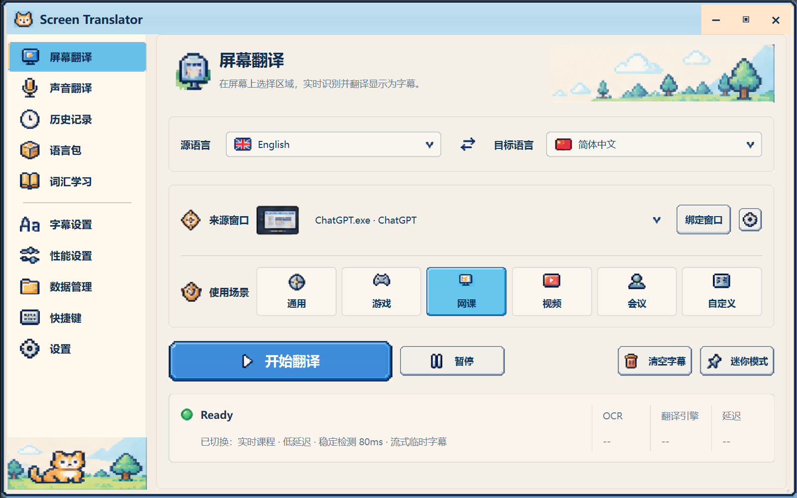
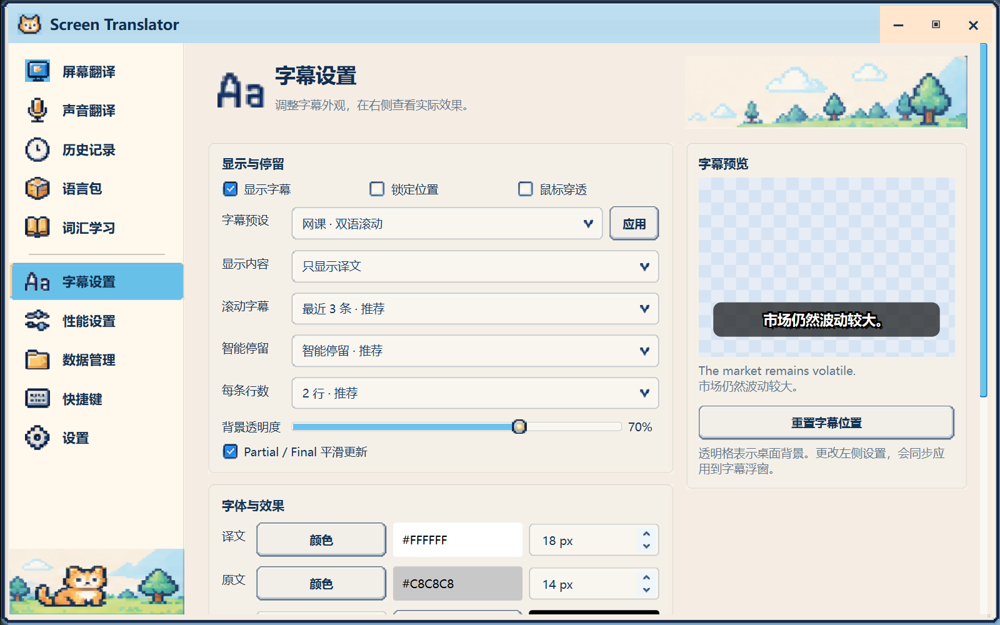

# 像素视觉还原 · 2026-09-29

本轮针对用户提供的主窗口目标图，以及当前主页面、字幕设置仍像旧式 Qt 表单的截图完成还原。主窗口继续只包含标题栏、导航和当前页面；没有重新引入 Design Board 展示画布。

## 实际变化

- 使用目标图中的猫 Logo、导航图标、山景、底部猫插画、来源图标和六个场景图标；导航改成无框行与蓝色选中底板。
- 主页面统一语言行、来源窗口行、场景选择、开始/暂停/清空/迷你模式和状态卡。语言名称由 Qt 绘制一次，英语、中文使用对应旗帜。
- 来源旁的齿轮打开独立高级参数窗口；最近翻译、复制、朗读和点词查询放在高级窗口中的“查看最近翻译”入口。
- 通用按钮、下拉框、输入框、表格、卡片使用目标 PNG 九宫格或 Qt border-image。复选框与滑块使用设计板对应素材，替换原来文件名与图形不匹配的素材。
- 字幕设置重建为左侧分组设置、右侧预览。预览使用浮动字幕相同的 SubtitleCanvas，颜色、字体、描边、阴影、透明度、双语模式实时同步。小窗口纵向滚动查看其余设置。
- 声音、历史、语言包、词汇、性能、数据、快捷键与设置页面沿用其功能布局，应用同一像素控件皮肤。迷你条使用同一皮肤，词汇弹窗增加像素卡片与主操作按钮。
- 六个场景入口均有行为：“会议”复用已有网课的低延迟参数并独立保存场景标识；“自定义”打开参数窗口。
- 应用退出时同时关闭高级参数、最近翻译及独立浮窗。

## 素材来源与维护

用户提供的主窗口图与多模块设计板保存在 `design/reference/`。运行以下命令可重新提取 55 张独立 PNG：

```powershell
.venv\Scripts\python.exe scripts/extract_target_assets.py
```

输出为 `screen_translator/resources/ui_target/`。边框保留目标转角/边缘，中间文字全部移除；文字仍由真实 Qt 控件绘制。整张参考截图不参与界面背景绘制。图标和自绘九宫格使用最近邻缩放。此次已有参考素材足够，不需要另行 AI 生成。

`ScreenTranslator.spec` 已纳入新资源。预检验证控件必要素材、样式表全部图片路径及打包声明。

## 实际运行验证

Windows 原生 Qt 后端、Python 3.12 / PySide6 6.11.2：

- `scripts/preflight.py` 和全部现有 `scripts/self_test.py` 通过。
- UI smoke 在 DPR 1.0、1.25、1.5 下通过；每档测试 1100×700、1280×800、1440×900、1920×1080。DPR 由 Qt 环境变量控制并断言实际值，未修改系统显示设置。
- 验证十页切换、独立窗口边界、主页面文字宽度、主页面与字幕页无横向溢出、语言菜单/交换、六场景、框选及取消、跨页迷你条、注入结果进入历史、收藏词汇、清空内容及偏好恢复。
- 验证高级参数和最近翻译窗口可打开；双语模式、透明度、字号与描边同时作用于实际字幕和设置预览。
- 模型推理、模型下载、真实音频识别、macOS 和安装包构建未在本轮测试。测试结果使用固定文本注入真实结果适配器，不能替代真实 OCR/ASR 端到端验证。

复现命令：

```powershell
.venv\Scripts\python.exe scripts/preflight.py
.venv\Scripts\python.exe scripts/self_test.py
.venv\Scripts\python.exe scripts/ui_smoke_test.py --native --scale 1 --output logs/ui-target/checks
.venv\Scripts\python.exe scripts/ui_smoke_test.py --native --scale 1.25 --output logs/ui-target/checks
.venv\Scripts\python.exe scripts/ui_smoke_test.py --native --scale 1.5 --output logs/ui-target/checks
.venv\Scripts\python.exe scripts/ui_smoke_test.py --native --scale 1.25 --capture-only --output logs/ui-target
```

实际截图（1280×800 logical pixels、125%）：





同一目录中还保存十页、迷你条与词汇弹窗截图，供继续逐页比较。

## 本轮文件清单

- 资源：`design/reference/*.png`、`screen_translator/resources/ui_target/*.png`、`scripts/extract_target_assets.py`。
- 外壳/共用控件：`ui/main_window.py`、`ui/assets.py`、`ui/theme.py`、`ui/pixel_theme.py`、`ui/components/pixel.py`、`ui/components/shell.py`。
- 页面：`ui/pages/screen_page.py`、`ui/pages/subtitle_page.py`、`ui/pages/existing_pages.py`、`ui/pages/preserved_pages.py`。
- 适配和弹窗：`ui/scene_presets.py`、`ui/window_logic.py`、`ui/desktop_actions.py`、`ui/word_popup.py`。
- 验证/交付：`scripts/ui_smoke_test.py`、`scripts/preflight.py`、`ScreenTranslator.spec`、`README.md`、本文件。上文 `ui/` 均相对于 `screen_translator/`。

工作区原有其他改动保留，不计入本轮视觉工作。

## 当前边界

主窗口和字幕设置已重排；其余页面是共用控件换肤，并未逐页重建成设计板布局。实际浮动字幕继续使用原字幕渲染器与透明背景，没有改成装饰性预览卡。macOS 字体差异、跨屏切换系统 DPI、实际翻译中长文本与设备场景仍需真实环境验收。来源窗口名称与状态文本来自运行时，不硬编码目标图里的示例内容。
